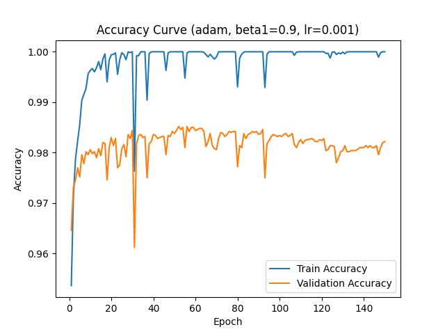
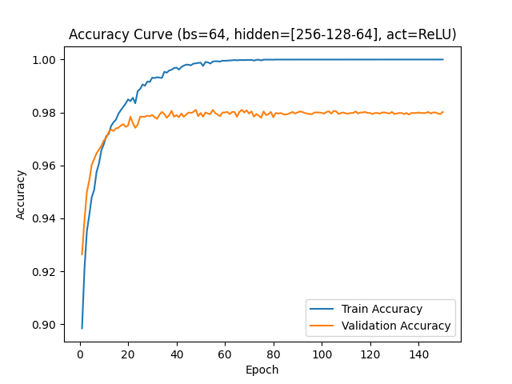

# 实验与结果分析

本节记录基于 NumPy 手写实现的多层感知机在 MNIST 数据集上的超参数实验。本实验的主要目的不是单纯寻找某一组“最优参数”，而是通过控制变量实验观察不同超参数对训练过程的影响，从而理解深度学习模型中学习率、batch size、网络容量、激活函数和优化器等概念的实际意义。

因此，本节更关注以下问题：

- 参数改变后，训练损失和验证损失会如何变化；
- 模型什么时候表现为欠拟合，什么时候表现为过拟合；
- 网络容量、优化器和学习率如何影响收敛速度和泛化能力；
- 为什么训练集准确率最高的模型不一定是泛化能力最好的模型。

## 1. 实验设置

### 1.1 数据集与预处理

实验使用 MNIST 手写数字数据集。原始图片大小为 `28 x 28`，每张图片被展平为 784 维向量，并将像素值从 `[0, 255]` 归一化到 `[0, 1]`。标签保留为整数类别，不进行 one-hot 编码。

数据划分如下：

| 数据集 | 样本数 | 用途 |
|---|---:|---|
| Train | 55000 | 参数训练 |
| Validation | 5000 | 超参数比较与过拟合判断 |
| Test | 10000 | 最终泛化性能评估 |

### 1.2 基线模型

除非当前实验专门改变模型结构，否则采用单隐藏层 MLP 作为基线：

```text
784 -> 128 -> 10
```

其中：

- 输入维度为 784；
- 隐藏层维度为 128；
- 输出维度为 10；
- 损失函数为 Softmax Cross Entropy；
- 权重初始化方式为 He initialization；
- 随机种子固定为 42。

基线配置如下：

| 超参数 | 取值 |
|---|---|
| `HIDDEN_DIMS` | `[128]` |
| `ACTIVATION` | `ReLU` |
| `BATCH_SIZE` | `64` |
| `LEARNING_RATE` | `0.01` |
| `OPTIMIZER` | `SGD` |
| `WEIGHT_INIT` | `he` |
| `NUM_EPOCHS` | `150` |
| `RANDOM_SEED` | `42` |

### 1.3 评价指标

每组实验记录以下指标：

| 指标 | 含义 |
|---|---|
| Train Loss | 最后一个 epoch 的训练集平均损失 |
| Validation Loss | 最后一个 epoch 的验证集平均损失 |
| Train Accuracy | 最后一个 epoch 的训练集准确率 |
| Validation Accuracy | 最后一个 epoch 的验证集准确率 |
| Test Accuracy | 训练结束后在测试集上的最终准确率 |

本报告不只关注 `Test Accuracy` 的高低，而是结合 `Train Loss`、`Validation Loss`、`Train Accuracy` 和 `Validation Accuracy` 来分析训练现象。测试集准确率用于观察最终泛化效果，但实验重点在于解释不同超参数为什么会导致不同的训练行为。

### 1.4 神经网络复杂度

除了准确率和损失，实验还需要考虑神经网络本身的复杂度。对于本项目的全连接 MLP，复杂度主要体现在两个方面：

- 参数量：每个 Linear 层的参数量为 `in_features * out_features + out_features`，其中前一项是权重，后一项是偏置；
- 计算量：前向传播中主要计算为矩阵乘法，单个样本经过一层 Linear 的乘法量约为 `in_features * out_features`。

反向传播还需要计算 `dW`、`db` 和 `dX`，因此训练阶段的实际计算量会高于单次前向传播。这里使用“每样本前向乘法量”作为相对复杂度指标，用来比较不同网络结构的计算开销。

典型结构的复杂度如下：

| Hidden Dims | 参数量 | 每样本前向乘法量 | 相对 `[128]` 计算量 |
|---|---:|---:|---:|
| [64] | 50,890 | 50,816 | 0.50x |
| [128] | 101,770 | 101,632 | 1.00x |
| [256] | 203,530 | 203,264 | 2.00x |
| [512] | 407,050 | 406,528 | 4.00x |
| [256, 128] | 235,146 | 234,752 | 2.31x |
| [256, 128, 64] | 242,762 | 242,304 | 2.38x |

由此可以看到，隐藏层宽度或深度增加不仅会改变准确率，也会直接增加参数量、内存占用和计算时间。复杂度更高的模型通常有更强的拟合能力，但也更容易过拟合，并且训练成本更高。

## 2. 学习率实验

### 2.1 实验目的

学习率决定每次参数更新的步长。学习率过小会导致收敛慢甚至欠拟合；学习率过大可能导致训练震荡或过拟合。该实验固定模型结构为 `[128]`，优化器为 SGD，比较 `0.001`、`0.01`、`0.1` 三种学习率。

### 2.2 实验结果

| Learning Rate | Train Acc | Val Acc | Test Acc | Train Loss | Val Loss | 结论 |
|---:|---:|---:|---:|---:|---:|---|
| 0.001 | 0.9449 | 0.9590 | 0.9457 | 0.1964 | 0.1603 | 学习率偏小，训练不足 |
| 0.01 | 0.9937 | 0.9806 | 0.9774 | 0.0322 | 0.0688 | 稳定基线配置 |
| 0.1 | 1.0000 | 0.9846 | 0.9790 | 0.0008 | 0.0803 | 收敛更强，但出现过拟合迹象 |

### 2.3 分析

`lr=0.001` 的训练集准确率只有 `94.49%`，测试集准确率也只有 `94.57%`，说明参数更新过慢，在 150 个 epoch 内没有充分拟合训练集。

`lr=0.01` 表现稳定，训练准确率达到 `99.37%`，测试准确率达到 `97.74%`，可以作为可靠的默认学习率。

`lr=0.1` 的测试准确率略高，达到 `97.90%`，但训练准确率已经达到 `100%`，训练损失接近 0，说明模型对训练集拟合非常充分。验证损失高于 `lr=0.01`，存在一定过拟合风险。

该实验说明，学习率本质上控制参数更新的步长。较小学习率会导致模型学习缓慢，较大学习率会加快拟合，但也更容易让模型过度贴合训练集。相比于单纯比较最终准确率，更重要的是理解学习率如何影响“收敛速度”和“过拟合风险”之间的关系。

从曲线可以进一步观察到，`lr=0.001` 的 loss 曲线下降平滑但整体位置较高，说明训练过程稳定但速度较慢；`lr=0.1` 的训练损失很快接近 0，但验证损失在前期下降后逐渐抬升，说明较大的学习率能快速降低训练误差，但也更容易进入过拟合状态。这个现象比最终准确率本身更能体现学习率的作用。

代表性训练曲线如下。`lr=0.001` 展示了学习率较小时的缓慢收敛，`lr=0.1` 展示了较大学习率下训练损失快速下降、验证损失后期抬升的现象。


## 3. Batch Size 实验

### 3.1 实验目的

Batch size 影响梯度估计的噪声大小和训练效率。较小 batch 的梯度噪声更大，可能有助于泛化；较大 batch 训练更平滑，但可能收敛较慢或泛化较差。

### 3.2 实验结果

| Batch Size | Train Acc | Val Acc | Test Acc | Train Loss | Val Loss | 结论 |
|---:|---:|---:|---:|---:|---:|---|
| 32 | 0.9991 | 0.9810 | 0.9784 | 0.0117 | 0.0706 | 准确率最高，但训练拟合较强 |
| 64 | 0.9937 | 0.9800 | 0.9775 | 0.0323 | 0.0699 | 稳定折中配置 |
| 128 | 0.9828 | 0.9782 | 0.9726 | 0.0664 | 0.0811 | 准确率下降 |
| 256 | 0.9681 | 0.9724 | 0.9634 | 0.1158 | 0.1071 | batch 过大，训练不足 |

### 3.3 分析

随着 batch size 增大，测试集准确率整体下降。`batch_size=32` 的测试准确率最高，为 `97.84%`；`batch_size=64` 非常接近，为 `97.75%`。当 batch size 增大到 `128` 和 `256` 时，训练准确率和测试准确率都明显下降，说明在相同 epoch 数下，大 batch 的参数更新次数更少，模型训练不够充分。

该实验说明，batch size 不只是影响训练速度，也会影响梯度更新的性质。较小 batch 的随机性更强，可能带来更好的泛化；较大 batch 的更新更平滑，但在相同 epoch 数下参数更新次数较少，容易出现训练不足。由此可以理解 mini-batch gradient descent 中“噪声”和“效率”之间的权衡。

代表性训练曲线如下。`batch_size=32` 的训练损失下降更快，但训练集拟合也更强；`batch_size=256` 的曲线更平滑，但整体收敛更慢，最终损失更高。


## 4. 隐藏层宽度实验

### 4.1 实验目的

隐藏层宽度决定模型容量。宽度过小会限制表达能力，宽度过大则可能带来过拟合和计算开销。该实验比较单隐藏层宽度为 `64`、`128`、`256`、`512` 时的表现。

### 4.2 实验结果

| Hidden Dims | 参数量 | 相对计算量 | Train Acc | Val Acc | Test Acc | Train Loss | Val Loss | 结论 |
|---|---:|---:|---:|---:|---:|---:|---:|---|
| [64] | 50,890 | 0.50x | 0.9901 | 0.9764 | 0.9735 | 0.0425 | 0.0817 | 容量偏小 |
| [128] | 101,770 | 1.00x | 0.9937 | 0.9800 | 0.9775 | 0.0323 | 0.0699 | 基线配置 |
| [256] | 203,530 | 2.00x | 0.9953 | 0.9806 | 0.9810 | 0.0259 | 0.0675 | 容量提升后泛化较好 |
| [512] | 407,050 | 4.00x | 0.9968 | 0.9834 | 0.9797 | 0.0228 | 0.0639 | 复杂度最高，测试集收益下降 |

### 4.3 分析

从 `[64]` 增大到 `[256]` 时，测试准确率从 `97.35%` 提升到 `98.10%`，说明增加隐藏层宽度可以提升模型表达能力。

当宽度继续增大到 `[512]` 时，验证准确率达到 `98.34%`，但测试准确率下降到 `97.97%`。从复杂度看，`[512]` 的参数量为 `407,050`，约为 `[128]` 的 4 倍。它确实进一步降低了训练损失，但测试集收益没有同步增加，说明更大的模型虽然能够更好地拟合训练集和验证集，但不一定带来更好的测试集泛化性能。

该实验说明，隐藏层宽度代表模型容量，也代表计算和存储开销。容量过小会限制模型表达能力，容量增加可以降低训练误差并提升准确率；但容量继续增大时，测试集收益不一定继续增加。这体现了深度学习中“模型容量”“计算复杂度”和“泛化能力”之间的关系。

代表性训练曲线如下。`hidden_width=64` 体现了模型容量较小时训练损失下降有限；`hidden_width=512` 体现了容量增大后训练损失进一步降低，但需要结合验证集曲线判断泛化效果。


## 5. 激活函数实验

### 5.1 实验目的

激活函数为网络引入非线性。ReLU 在正区间梯度为 1，通常更容易训练；Sigmoid 在输入绝对值较大时容易饱和，可能导致梯度变小。

### 5.2 实验结果

| Activation | Train Acc | Val Acc | Test Acc | Train Loss | Val Loss | 结论 |
|---|---:|---:|---:|---:|---:|---|
| ReLU | 0.9937 | 0.9800 | 0.9775 | 0.0323 | 0.0699 | 明显更好 |
| Sigmoid | 0.9557 | 0.9660 | 0.9531 | 0.1551 | 0.1330 | 收敛慢，准确率低 |

### 5.3 分析

ReLU 的测试准确率为 `97.75%`，明显高于 Sigmoid 的 `95.31%`。Sigmoid 的训练准确率仅为 `95.57%`，说明模型本身没有充分拟合训练集，主要问题是欠拟合或训练困难，而不是过拟合。

该实验说明，激活函数会直接影响反向传播中的梯度传递。Sigmoid 容易进入饱和区，使梯度变小，从而训练较慢；ReLU 在正区间梯度稳定，因此更容易训练。通过该对比可以直观看到激活函数并不是简单的形式选择，而会改变模型的优化难度。

代表性训练曲线如下。ReLU 的 loss 下降更充分，Sigmoid 的 loss 曲线整体更高，说明其隐藏层梯度传播和优化过程相对困难。


## 6. 优化器实验

### 6.1 实验目的

优化器决定参数更新方式。SGD 结构简单但对学习率敏感；Momentum 通过累积历史梯度方向加速收敛；Adam 结合一阶矩和二阶矩估计，通常收敛较快。

### 6.2 优化器类型对比

| Optimizer | Arguments | Train Acc | Val Acc | Test Acc | Train Loss | Val Loss | 结论 |
|---|---|---:|---:|---:|---:|---:|---|
| SGD | `lr=0.01` | 0.9937 | 0.9806 | 0.9774 | 0.0322 | 0.0688 | 稳定基线 |
| Momentum | `lr=0.01, momentum=0.9` | 1.0000 | 0.9814 | 0.9781 | 0.0008 | 0.0869 | 收敛更强，略有过拟合 |
| Adam | `lr=0.001, beta1=0.9, beta2=0.999` | 1.0000 | 0.9822 | 0.9803 | 0.0000 | 0.1637 | 准确率高，但 val loss 偏高 |

三种优化器使用的是同一个 `[128]` 网络，因此模型参数量相同，均为 `101,770`。不过优化器自身也有额外状态开销：SGD 几乎不需要额外状态；Momentum 需要为每个参数保存一个速度变量，额外状态约为 1 倍参数量；Adam 需要保存一阶矩和二阶矩，额外状态约为 2 倍参数量。因此 Adam 不仅更新规则更复杂，也需要更多内存。

### 6.3 Momentum 系数对比

| Momentum | Train Acc | Val Acc | Test Acc | Train Loss | Val Loss | 结论 |
|---:|---:|---:|---:|---:|---:|---|
| 0.5 | 0.9991 | 0.9814 | 0.9784 | 0.0116 | 0.0701 | 曲线较平稳 |
| 0.9 | 1.0000 | 0.9814 | 0.9781 | 0.0008 | 0.0869 | 后期验证损失上升 |
| 0.99 | 1.0000 | 0.9828 | 0.9808 | 0.0000 | 0.1225 | 前期震荡明显，过拟合更强 |

### 6.4 Adam beta1 对比

| Beta1 | Train Acc | Val Acc | Test Acc | Train Loss | Val Loss | 结论 |
|---:|---:|---:|---:|---:|---:|---|
| 0.5 | 1.0000 | 0.9804 | 0.9800 | 0.0003 | 0.1714 | 验证损失有尖峰震荡 |
| 0.9 | 1.0000 | 0.9822 | 0.9803 | 0.0000 | 0.1637 | 验证准确率和损失均有波动 |
| 0.99 | 0.9995 | 0.9804 | 0.9784 | 0.0008 | 0.1893 | 验证损失持续升高 |

### 6.5 分析

Adam 和高 momentum 都能让训练集准确率接近或达到 `100%`，测试准确率也略高于普通 SGD。但这些配置的验证损失明显高于 SGD，尤其是 Adam 的验证损失达到 `0.1637`，说明模型对训练集的拟合过强。

该实验说明，优化器改变的是参数更新的方向和步长调节方式，也改变训练过程中的状态复杂度。Momentum 和 Adam 能更快、更强地拟合训练集，但也可能使训练损失迅速接近 0，从而带来更明显的过拟合现象。相比之下，SGD 虽然简单，但额外内存开销最小，训练行为也更容易观察，更适合作为理解梯度下降原理的基线。

从曲线图中还能观察到训练过程的震荡现象。以 Momentum 为例，`momentum=0.5` 的验证损失下降后基本保持平稳，而 `momentum=0.99` 的验证损失在前 20 个 epoch 内出现明显上下波动，之后虽然训练损失接近 0，但验证损失持续缓慢升高。这说明动量系数过大时，历史梯度方向占比过高，参数更新可能在局部较优区域附近“冲过头”，导致验证集表现不稳定。


Adam 的曲线中震荡更明显。`beta1=0.5`、`0.9` 和 `0.99` 的训练损失都很快接近 0，但验证损失曲线并不平滑，而是出现多次尖峰，并整体呈上升趋势。特别是 `beta1=0.9` 的准确率曲线中，训练准确率接近 1 后仍有短暂下跌，验证准确率也有明显波动。这说明自适应优化器虽然能快速拟合训练集，但其参数更新更激进，验证集上的泛化误差可能更不稳定。




因此，优化器实验不能只看最后的 `test_accuracy`。曲线中的震荡、尖峰和验证损失上升，反而更能帮助我们理解 Momentum 和 Adam 的更新机制：它们可以加速优化，但也会放大过拟合和不稳定性。

作为对照，SGD 的曲线整体更平滑，虽然训练损失下降速度不如 Momentum 和 Adam 激进，但更容易观察基本梯度下降过程。


## 7. 隐藏层深度实验

### 7.1 实验目的

增加隐藏层数可以提升模型表达能力，但也会增加训练难度和过拟合风险。该实验比较一层、两层和三层隐藏层结构。

### 7.2 实验结果

| Hidden Dims | 参数量 | 相对计算量 | Train Acc | Val Acc | Test Acc | Train Loss | Val Loss | 结论 |
|---|---:|---:|---:|---:|---:|---:|---:|---|
| [128] | 101,770 | 1.00x | 0.9937 | 0.9800 | 0.9775 | 0.0323 | 0.0699 | 基线 |
| [256, 128] | 235,146 | 2.31x | 1.0000 | 0.9812 | 0.9794 | 0.0039 | 0.0800 | 复杂度提高，有过拟合 |
| [256, 128, 64] | 242,762 | 2.38x | 1.0000 | 0.9802 | 0.9772 | 0.0009 | 0.1029 | 更深但测试集下降 |

### 7.3 分析

两层隐藏层 `[256, 128]` 的测试准确率为 `97.94%`，高于单层 `[128]` 的 `97.75%`，说明适当加深网络可以提升表达能力。但它的参数量从 `101,770` 增加到 `235,146`，前向计算量约为基线的 `2.31` 倍，因此这种提升伴随着明显的复杂度增加。

三层隐藏层 `[256, 128, 64]` 的训练准确率达到 `100%`，但测试准确率下降到 `97.72%`，验证损失也上升到 `0.1029`。它的参数量为 `242,762`，计算量约为基线的 `2.38` 倍。与两层结构相比，它的复杂度继续增加，但泛化表现没有继续提升，说明进一步加深后过拟合更明显。

该实验说明，增加网络深度确实可以提升模型表达能力，但深度增加也会提高计算复杂度、优化难度和过拟合风险。对于 MNIST 这样相对简单的数据集，更深的 MLP 不一定带来更好的泛化效果。这个现象帮助我们理解：深度学习中的“更深”并不自动等于“更好”。

代表性训练曲线如下。单隐藏层 `[128]` 的训练较稳定；三隐藏层 `[256,128,64]` 的训练损失接近 0，但验证损失后期更高，反映了深度增加后的过拟合倾向。


## 8. 过拟合分析

本实验中，过拟合主要表现为：

```text
Train Accuracy 接近或达到 100%
Train Loss 接近 0
Validation Loss 明显高于基线
Validation/Test Accuracy 提升有限甚至下降
```

典型例子如下：

| 配置 | Train Acc | Val Acc | Test Acc | Val Loss | 判断 |
|---|---:|---:|---:|---:|---|
| Adam, beta1=0.9 | 1.0000 | 0.9822 | 0.9803 | 0.1637 | 明显过拟合 |
| Momentum=0.99 | 1.0000 | 0.9828 | 0.9808 | 0.1225 | 有过拟合风险 |
| Hidden Dims=[256,128,64] | 1.0000 | 0.9802 | 0.9772 | 0.1029 | 加深后过拟合 |
| Hidden Dims=[256] | 0.9953 | 0.9806 | 0.9810 | 0.0675 | 泛化较好 |

可以看到，训练集表现最好的模型并不一定测试集最好。单隐藏层 `[256]` 虽然训练准确率不是最高，但测试准确率较高，验证损失也较低，说明其泛化能力更好。从复杂度角度看，它的参数量约为 `[128]` 的 2 倍，但比 `[512]` 和更深网络更轻，因此体现了容量和复杂度之间较好的平衡。

结合曲线图来看，过拟合不一定只表现为最终验证准确率下降。有些实验中验证准确率仍然维持在较高水平，但验证损失已经明显上升或出现震荡，例如 Adam 和高 momentum 实验。这说明模型对某些验证样本的预测可能变得更加自信但不一定更正确，交叉熵损失会比准确率更早反映这种问题。因此，分析训练过程时应同时观察 accuracy curve 和 loss curve。

典型过拟合曲线如下。三层隐藏层实验中，训练损失持续下降并接近 0，而验证损失在后期上升，说明模型对训练集拟合更强，但泛化能力没有同步提升。



## 9. 实验结论

### 9.1 主要观察结果

作为一个代表性结果，`hidden_dims=[256]` 这一组在测试集上取得了较高准确率，同时验证损失相对较低：

```text
hidden_dims = [256]
activation = ReLU
batch_size = 64
optimizer = SGD
learning_rate = 0.01
weight_init = he
random_seed = 42
```

其结果为：

| Metric | Value |
|---|---:|
| Train Loss | 0.0259 |
| Validation Loss | 0.0675 |
| Train Accuracy | 0.9953 |
| Validation Accuracy | 0.9806 |
| Test Accuracy | 0.9810 |

但本实验更重要的结论不是“这组参数最好”，而是通过不同实验现象理解各类超参数的作用。各组实验反映出的规律如下。

### 9.2 对超参数意义的理解

1. 学习率控制参数更新步长。学习率太小会欠拟合，学习率较大可以加快收敛，但可能带来过拟合或不稳定。
2. Batch size 影响梯度估计的随机性。小 batch 更新更频繁、噪声更大，可能有助于泛化；大 batch 更平滑，但可能训练不足。
3. 隐藏层宽度代表模型容量。容量增加能提升拟合能力，但容量过大时测试集收益可能下降。
4. 激活函数影响梯度传播。ReLU 比 Sigmoid 更容易训练，Sigmoid 容易因梯度变小而收敛较慢。
5. 优化器影响收敛路径和额外状态开销。Momentum 和 Adam 能加速拟合，但也会更快把训练集拟合到接近 100%，因此需要关注验证损失和训练稳定性。
6. 网络深度增加会提高表达能力，但也会增加参数量、计算量和过拟合风险。对于 MNIST，简单 MLP 已经可以达到较高准确率。
7. 训练集准确率、验证集准确率和测试集准确率需要一起看。只看训练集准确率会误判模型效果。
8. 训练曲线中的震荡也是重要信息。它说明参数更新过程并非单调变好，优化器和超参数会影响训练稳定性。
9. 神经网络实验需要同时考虑效果和复杂度。更复杂的网络不一定带来更好的泛化，却一定会增加训练成本。

### 9.3 本实验的学习收获

通过这些实验可以看到，深度学习训练不是简单地把模型调到训练集准确率最高，而是在模型容量、优化速度和泛化能力之间寻找平衡。不同超参数对应不同的训练现象：有的导致欠拟合，有的加速收敛，有的提升表达能力但增加过拟合风险。

因此，本实验的核心收获是：通过亲自实现和比较这些配置，我们能够更具体地理解深度学习中的基本概念，而不是只把它们当作配置文件中的数字。

### 9.4 后续改进方向

为了进一步观察和理解泛化能力与过拟合现象，可以考虑：

- 使用 early stopping，保存验证集准确率最高的模型；
- 添加 weight decay 或 dropout；
- 对 Adam、Momentum 配置使用学习率衰减；
- 对 `[256]`、`[512]`、`[256,128]` 等代表性结构进行更多随机种子重复实验；
- 引入 CNN 结构，更好地利用图像的空间局部信息。

## 10. 实验文件说明

实验结果和曲线保存在 `experiments/` 目录下：

| 文件或目录 | 内容 |
|---|---|
| `experiments/hyperparameter_summary.csv` | batch size、隐藏层宽度、激活函数、隐藏层深度实验汇总 |
| `experiments/summary.csv` | 优化器、Momentum、Adam、学习率实验汇总 |
| `experiments/*/*/config.json` | 每组实验的超参数 |
| `experiments/*/*/results.json` | 每组实验的最终指标 |
| `experiments/*/*/loss_curve.png` | 训练与验证 loss 曲线 |
| `experiments/*/*/accuracy_curve.png` | 训练与验证 accuracy 曲线 |
