# NumPy 手写神经网络实验报告

## 1. 项目目标

本项目对应《人工智能基础》大作业选题二：使用 NumPy 从零实现神经网络，理解前向传播、反向传播和参数优化的基本原理，并在 MNIST 手写数字数据集上完成分类任务。

项目核心目标如下：

1. 不使用 PyTorch、TensorFlow 等自动微分框架；
2. 使用 NumPy 实现 MLP 的前向传播、反向传播和参数更新；
3. 实现清晰的 `Layer / Loss / Optimizer / Model` 代码结构；
4. 在 MNIST 测试集上达到 95% 以上准确率；
5. 完成训练曲线绘制和超参数对比实验；
6. 尝试 CNN 和多数据集接口等扩展内容。

本项目的重点不是单纯寻找最高准确率，而是通过亲自实现和实验，理解深度学习训练过程中各个组件的作用。

## 2. 数学原理与反向传播

项目统一采用 row-major 数据约定，即每一行表示一个样本：

```text
X.shape = (B, D)
y.shape = (B,)
logits.shape = (B, C)
```

其中 `B` 为 batch size，`D` 为输入维度，`C` 为类别数。以 MNIST 为例，`D=784`，`C=10`。

### 2.1 前向传播

全连接层的前向传播为：

\[
Z = XW + b
\]

其中：

| 符号 | Shape |
|---|---|
| \(X\) | \((B, D_{in})\) |
| \(W\) | \((D_{in}, D_{out})\) |
| \(b\) | \((D_{out},)\) |
| \(Z\) | \((B, D_{out})\) |

隐藏层输出再经过激活函数：

\[
A = g(Z)
\]

本项目主要使用 ReLU 和 Sigmoid：

\[
\operatorname{ReLU}(z)=\max(0,z)
\]

\[
\sigma(z)=\frac{1}{1+e^{-z}}
\]

激活函数用于引入非线性，否则多层线性层叠加后仍然等价于一个线性模型。

### 2.2 Softmax Cross Entropy

最后一层输出 logits：

\[
S.shape=(B,C)
\]

Softmax 将 logits 转换为类别概率：

\[
P_{ij}=\frac{e^{S_{ij}}}{\sum_{k=1}^{C}e^{S_{ik}}}
\]

实际实现中，为了避免指数溢出，会先减去每一行的最大值：

\[
\tilde{S}_{ij}=S_{ij}-\max_k S_{ik}
\]

交叉熵损失为：

\[
L=-\frac{1}{B}\sum_{i=1}^{B}\log P_{i,y_i}
\]

其中 \(y_i\) 是第 \(i\) 个样本的真实类别。本项目标签保持为整数形式，不在数据模块中提前转换为 one-hot。

### 2.3 Softmax Cross Entropy 梯度

Softmax 与交叉熵组合后，损失对 logits 的梯度可以简化为：

\[
\frac{\partial L}{\partial S}=\frac{P-Y}{B}
\]

其中 \(Y\) 是标签对应的 one-hot 矩阵。代码中没有显式构造完整 \(Y\)，而是在正确类别位置减 1：

```python
dlogits = probs.copy()
dlogits[np.arange(batch_size), labels] -= 1
dlogits /= batch_size
```

该梯度会作为最后一层 Linear 的上游梯度继续反向传播。

### 2.4 Linear 层反向传播

Linear 层前向传播为：

\[
Z=XW+b
\]

假设上一层传来的梯度为：

\[
dZ=\frac{\partial L}{\partial Z}
\]

则 Linear 层的反向传播为：

\[
dW=X^T dZ
\]

\[
db=\sum_{i=1}^{B} dZ_i
\]

\[
dX=dZ W^T
\]

对应代码为：

```python
self.dW = self.X.T @ dout
self.db = np.sum(dout, axis=0)
self.dX = dout @ self.W.T
```

这是本项目手写反向传播的核心。

### 2.5 单隐藏层 MLP 的 Shape 流程

以基线模型为例：

```text
784 -> 128 -> 10
```

前向传播 shape 如下：

| 步骤 | Shape |
|---|---|
| \(X\) | \((B, 784)\) |
| \(W_1\) | \((784, 128)\) |
| \(Z_1=XW_1+b_1\) | \((B, 128)\) |
| \(A_1=\operatorname{ReLU}(Z_1)\) | \((B, 128)\) |
| \(W_2\) | \((128, 10)\) |
| \(S=A_1W_2+b_2\) | \((B, 10)\) |
| \(P=\operatorname{softmax}(S)\) | \((B, 10)\) |
| \(L\) | scalar |

反向传播从 \(dS=(P-Y)/B\) 开始，然后依次经过第二个 Linear 层、激活函数和第一个 Linear 层。`Sequential.backward()` 按前向传播的相反顺序调用每一层的 `backward()`，从而实现链式法则。

### 2.6 参数更新

反向传播完成后，每个可训练层会提供参数和梯度：

```text
(W, dW)
(b, db)
```

SGD：

\[
\theta := \theta - \eta \nabla_\theta L
\]

Momentum：

\[
v := \mu v - \eta \nabla_\theta L
\]

\[
\theta := \theta + v
\]

Adam：

\[
m_t=\beta_1m_{t-1}+(1-\beta_1)g_t
\]

\[
v_t=\beta_2v_{t-1}+(1-\beta_2)g_t^2
\]

\[
\theta:=\theta-\eta\frac{\hat{m}_t}{\sqrt{\hat{v}_t}+\epsilon}
\]

其中 \(g_t\) 表示当前梯度，\(\eta\) 是学习率。

## 3. 工程实现

项目采用模块化结构：

```text
data/          数据读取、预处理、mini-batch 生成
nn/            神经网络核心模块
utils/         训练辅助工具
experiments/   超参数实验与扩展实验
tests/         单元测试
reports/       报告与实验分析
```

核心入口脚本包括：

| 文件 | 作用 |
|---|---|
| `train.py` | 主训练脚本，支持 MLP / CNN、不同数据集和不同优化器 |
| `evaluate.py` | 加载 checkpoint，对测试集进行整体评估 |
| `visualize_predictions.py` | 可视化测试集预测结果 |
| `demo_handwritten_digit.py` | 手写数字 demo |
| `config.py` | 集中管理模型、数据集和训练超参数 |

### 3.1 数据模块

`data/` 目录负责数据读取和格式统一。目前支持：

```text
mnist
fashionmnist
cifar10
```

三个数据模块都暴露统一变量：

```python
X_train, y_train
X_val, y_val
X_test, y_test
```

并保持：

```text
X.shape = (num_samples, num_features)
y.shape = (num_samples,)
```

`data.dataloader.create_mini_batches()` 用于训练阶段 mini-batch 划分和 shuffle。对于 CNN，`data.transforms.to_nchw_images()` 会将展平图像恢复为：

```text
(num_samples, channels, height, width)
```

### 3.2 神经网络核心模块

`nn/` 目录实现神经网络核心组件。各层遵循统一接口：

```python
forward(X)
backward(dout)
params_and_grads()
```

主要模块包括：

| 模块 | 作用 |
|---|---|
| `Linear` | 全连接层 |
| `ReLU / Sigmoid` | 激活函数 |
| `SoftmaxCrossEntropyLoss` | 多分类损失 |
| `SGD / Momentum / Adam` | 参数优化器 |
| `Sequential` | 按顺序组织多个层 |
| `Conv2D / MaxPool2D / Flatten` | CNN 扩展模块 |

`Sequential.forward()` 按顺序调用每一层，`Sequential.backward()` 按相反顺序调用每一层，这对应链式法则在代码中的实现。

### 3.3 训练流程

`train.py` 的整体流程为：

1. 根据 `config.py` 选择数据集；
2. 根据 `MODEL_TYPE` 构建 MLP 或 CNN；
3. 创建损失函数和优化器；
4. 使用 mini-batch 训练；
5. 在训练集和验证集上计算 loss / accuracy；
6. 记录训练历史并绘制曲线；
7. 在测试集上评估最终准确率；
8. 保存 checkpoint。

单个 mini-batch 的训练步骤为：

```text
forward -> loss -> backward -> optimizer.step
```

### 3.4 评估、绘图与 checkpoint

`utils.metrics.evaluate()` 用于非 shuffle 的批量评估。它可以只计算 accuracy，也可以在传入 criterion 时同时计算平均 loss。

`utils.plot.plot_history()` 保存：

```text
loss_curve.png
accuracy_curve.png
```

`utils.checkpoint` 使用 `.npz` 格式保存模型参数和超参数 metadata。训练完成时会保存 `latest_model.npz`，同时也会按照超参数生成命名 checkpoint。若训练过程中使用 `Ctrl+C` 中断，也会保存当前模型，避免长时间训练结果丢失。

## 4. 实验设置

主要实验使用 MNIST 手写数字数据集。原始图片大小为 `28 x 28`，展平为 784 维向量，并将像素值从 `[0, 255]` 归一化到 `[0, 1]`。标签保留为整数类别，不进行 one-hot 编码。

数据划分如下：

| 数据集 | 样本数 | 用途 |
|---|---:|---|
| Train | 55000 | 参数训练 |
| Validation | 5000 | 超参数比较与过拟合判断 |
| Test | 10000 | 最终泛化性能评估 |

基线模型为：

```text
784 -> 128 -> 10
```

基线配置如下：

| 超参数 | 取值 |
|---|---|
| `HIDDEN_DIMS` | `[128]` |
| `ACTIVATION` | `ReLU` |
| `BATCH_SIZE` | `64` |
| `LEARNING_RATE` | `0.01` |
| `OPTIMIZER` | `SGD` |
| `WEIGHT_INIT` | `he` |
| `RANDOM_SEED` | `42` |

本报告不只关注最终测试准确率，也结合训练损失、验证损失、训练准确率和验证准确率分析训练过程。

## 5. MNIST 达标结果

在超参数实验中，多组 MLP 模型均超过 MNIST 测试集 95% 准确率要求。其中代表性配置为：

```text
hidden_dims = [256]
activation = ReLU
batch_size = 64
optimizer = SGD
learning_rate = 0.01
weight_init = he
random_seed = 42
```

结果如下：

| Metric | Value |
|---|---:|
| Train Loss | 0.0259 |
| Validation Loss | 0.0675 |
| Train Accuracy | 0.9953 |
| Validation Accuracy | 0.9806 |
| Test Accuracy | 0.9810 |

这说明项目已满足“MNIST 测试集准确率达到 95% 以上”的核心要求。

## 6. 超参数实验与分析

本实验的目的不是单纯寻找最优参数，而是通过控制变量观察不同超参数对训练过程的影响。

### 6.1 学习率

| Learning Rate | Train Acc | Val Acc | Test Acc | Train Loss | Val Loss | 结论 |
|---:|---:|---:|---:|---:|---:|---|
| 0.001 | 0.9449 | 0.9590 | 0.9457 | 0.1964 | 0.1603 | 学习率偏小，训练不足 |
| 0.01 | 0.9937 | 0.9806 | 0.9774 | 0.0322 | 0.0688 | 稳定基线配置 |
| 0.1 | 1.0000 | 0.9846 | 0.9790 | 0.0008 | 0.0803 | 收敛更强，但有过拟合迹象 |

学习率控制参数更新步长。较小学习率会导致收敛慢，较大学习率可以更快拟合训练集，但也更容易使验证损失升高。

代表性曲线：

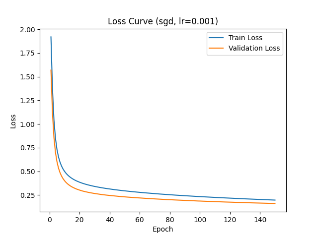

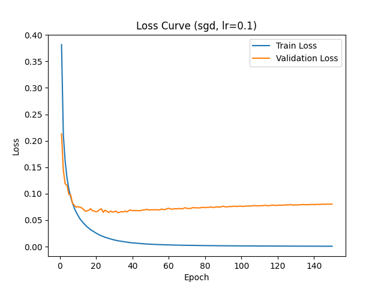

### 6.2 Batch Size

| Batch Size | Train Acc | Val Acc | Test Acc | Train Loss | Val Loss | 结论 |
|---:|---:|---:|---:|---:|---:|---|
| 32 | 0.9991 | 0.9810 | 0.9784 | 0.0117 | 0.0706 | 准确率较高，但训练拟合较强 |
| 64 | 0.9937 | 0.9800 | 0.9775 | 0.0323 | 0.0699 | 稳定折中配置 |
| 128 | 0.9828 | 0.9782 | 0.9726 | 0.0664 | 0.0811 | 准确率下降 |
| 256 | 0.9681 | 0.9724 | 0.9634 | 0.1158 | 0.1071 | batch 过大，训练不足 |

较小 batch 更新更频繁，梯度噪声更大；较大 batch 训练更平滑，但在相同 epoch 数下参数更新次数更少，可能训练不足。

代表性曲线：

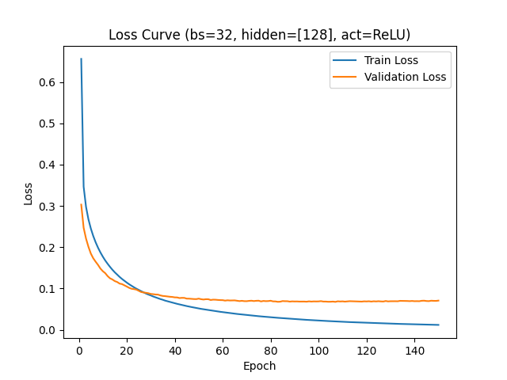

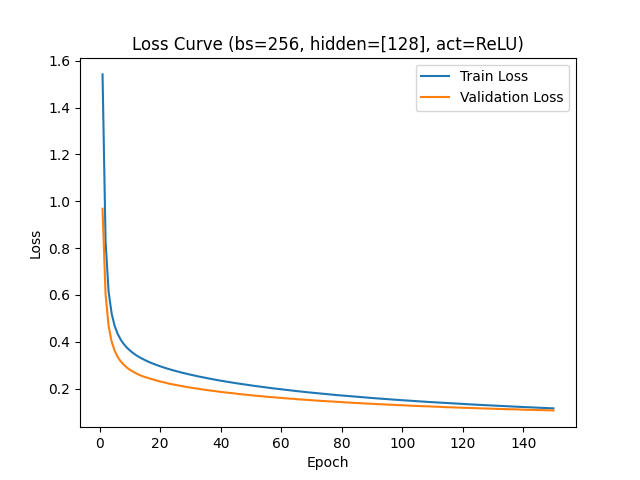

### 6.3 隐藏层宽度

| Hidden Dims | 参数量 | 相对计算量 | Train Acc | Val Acc | Test Acc | Train Loss | Val Loss |
|---|---:|---:|---:|---:|---:|---:|---:|
| [64] | 50,890 | 0.50x | 0.9901 | 0.9764 | 0.9735 | 0.0425 | 0.0817 |
| [128] | 101,770 | 1.00x | 0.9937 | 0.9800 | 0.9775 | 0.0323 | 0.0699 |
| [256] | 203,530 | 2.00x | 0.9953 | 0.9806 | 0.9810 | 0.0259 | 0.0675 |
| [512] | 407,050 | 4.00x | 0.9968 | 0.9834 | 0.9797 | 0.0228 | 0.0639 |

隐藏层宽度代表模型容量。容量增加可以提升拟合能力，但也会增加参数量和计算成本。`[512]` 虽然容量最大，但测试准确率没有继续提升，说明更复杂的模型不一定泛化更好。

代表性曲线：

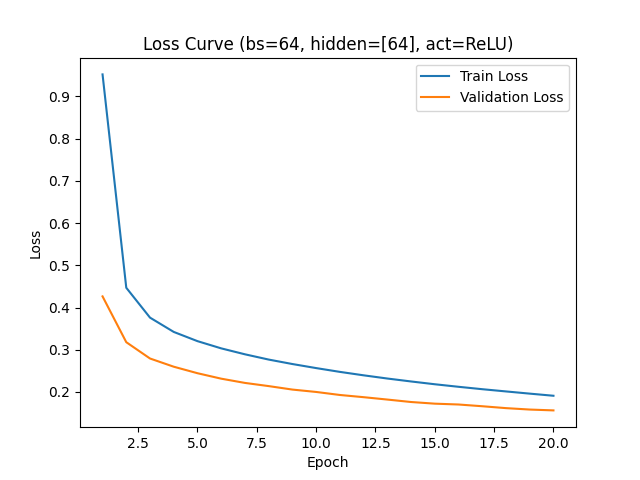


### 6.4 激活函数

| Activation | Train Acc | Val Acc | Test Acc | Train Loss | Val Loss | 结论 |
|---|---:|---:|---:|---:|---:|---|
| ReLU | 0.9937 | 0.9800 | 0.9775 | 0.0323 | 0.0699 | 更容易训练 |
| Sigmoid | 0.9557 | 0.9660 | 0.9531 | 0.1551 | 0.1330 | 收敛慢，准确率低 |

ReLU 在正区间梯度稳定，更适合作为隐藏层激活函数。Sigmoid 容易在输入较大或较小时进入饱和区，导致梯度变小。

代表性曲线：


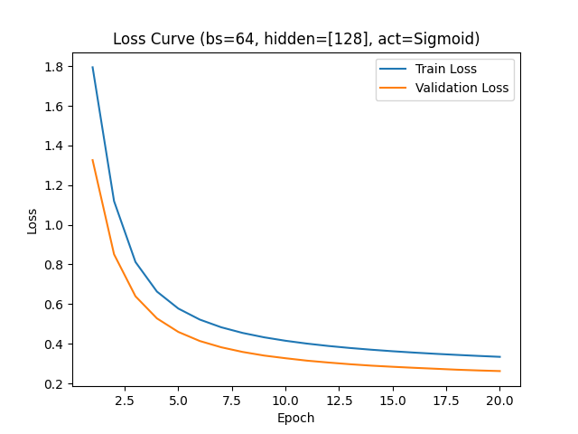

### 6.5 优化器

| Optimizer | Arguments | Train Acc | Val Acc | Test Acc | Train Loss | Val Loss |
|---|---|---:|---:|---:|---:|---:|
| SGD | `lr=0.01` | 0.9937 | 0.9806 | 0.9774 | 0.0322 | 0.0688 |
| Momentum | `lr=0.01, momentum=0.9` | 1.0000 | 0.9814 | 0.9781 | 0.0008 | 0.0869 |
| Adam | `lr=0.001, beta1=0.9, beta2=0.999` | 1.0000 | 0.9822 | 0.9803 | 0.0000 | 0.1637 |

Momentum 和 Adam 能更快拟合训练集，但验证损失明显高于 SGD，说明更强的优化器也可能带来更明显的过拟合和震荡。

代表性曲线：

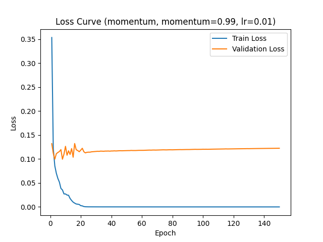

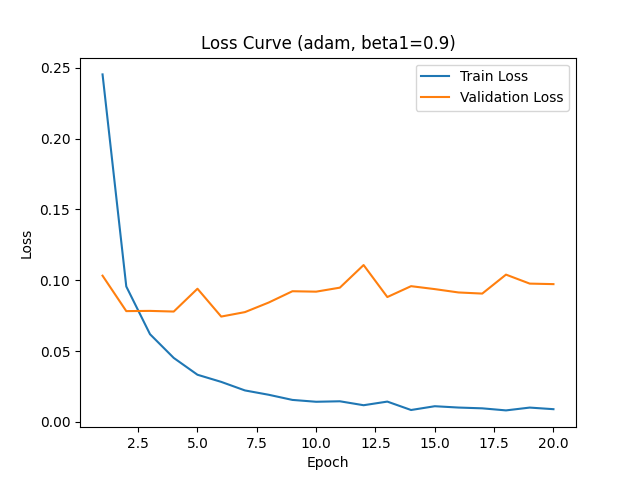

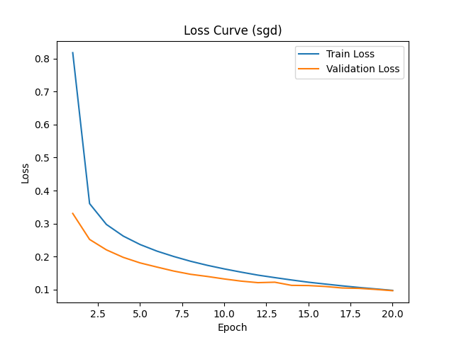

### 6.6 隐藏层深度

| Hidden Dims | 参数量 | 相对计算量 | Train Acc | Val Acc | Test Acc | Train Loss | Val Loss |
|---|---:|---:|---:|---:|---:|---:|---:|
| [128] | 101,770 | 1.00x | 0.9937 | 0.9800 | 0.9775 | 0.0323 | 0.0699 |
| [256, 128] | 235,146 | 2.31x | 1.0000 | 0.9812 | 0.9794 | 0.0039 | 0.0800 |
| [256, 128, 64] | 242,762 | 2.38x | 1.0000 | 0.9802 | 0.9772 | 0.0009 | 0.1029 |

适当加深网络可以提升表达能力，但深度增加也会提高计算复杂度和过拟合风险。对于 MNIST，简单 MLP 已经可以达到较高准确率，更深并不一定更好。

代表性曲线：

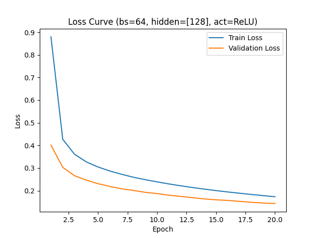

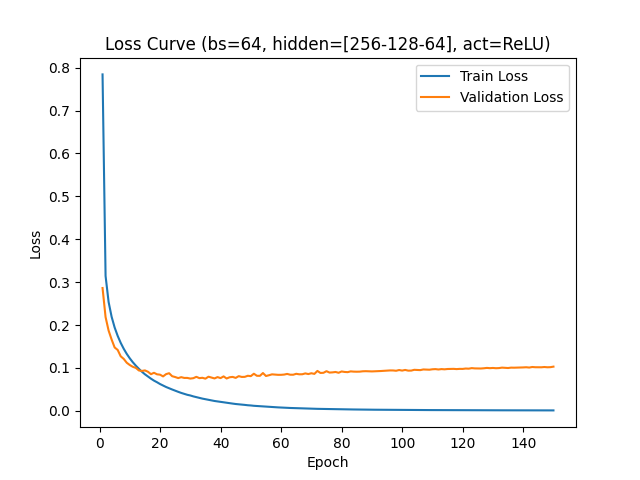

## 7. 复杂度与过拟合分析

对于全连接 MLP，复杂度主要体现在参数量和矩阵乘法计算量。每个 Linear 层的参数量为：

```text
in_features * out_features + out_features
```

典型结构复杂度如下：

| Hidden Dims | 参数量 | 每样本前向乘法量 | 相对 `[128]` 计算量 |
|---|---:|---:|---:|
| [64] | 50,890 | 50,816 | 0.50x |
| [128] | 101,770 | 101,632 | 1.00x |
| [256] | 203,530 | 203,264 | 2.00x |
| [512] | 407,050 | 406,528 | 4.00x |
| [256, 128] | 235,146 | 234,752 | 2.31x |
| [256, 128, 64] | 242,762 | 242,304 | 2.38x |

过拟合主要表现为：

```text
Train Accuracy 接近或达到 100%
Train Loss 接近 0
Validation Loss 明显高于基线
Validation/Test Accuracy 提升有限甚至下降
```

典型例子：

| 配置 | Train Acc | Val Acc | Test Acc | Val Loss | 判断 |
|---|---:|---:|---:|---:|---|
| Adam, beta1=0.9 | 1.0000 | 0.9822 | 0.9803 | 0.1637 | 明显过拟合 |
| Momentum=0.99 | 1.0000 | 0.9828 | 0.9808 | 0.1225 | 有过拟合风险 |
| Hidden Dims=[256,128,64] | 1.0000 | 0.9802 | 0.9772 | 0.1029 | 加深后过拟合 |
| Hidden Dims=[256] | 0.9953 | 0.9806 | 0.9810 | 0.0675 | 泛化较好 |

训练集准确率最高的模型不一定测试集最好。实验中，`hidden_dims=[256]` 虽然训练准确率不是最高，但测试准确率较高，验证损失也较低，体现了模型容量和泛化能力之间较好的平衡。

## 8. 加分项实现

本项目在基础 MLP 之外，实现了两个扩展方向：多数据集统一接口和基础 CNN 结构。

### 8.1 多数据集统一接口

项目支持：

```text
MNIST
Fashion-MNIST
CIFAR-10
```

三个数据模块都提供统一变量：

```python
X_train, y_train
X_val, y_val
X_test, y_test
```

不同数据集的输入维度如下：

| 数据集 | 原始图像 | 展平后维度 |
|---|---|---:|
| MNIST | `1 x 28 x 28` | 784 |
| Fashion-MNIST | `1 x 28 x 28` | 784 |
| CIFAR-10 | `3 x 32 x 32` | 3072 |

为了验证接口通用性，项目新增：

```text
experiments/run_dataset_experiments.py
```

代表性接口验证结果如下：

| 数据集 | 模型 | Test Accuracy | 说明 |
|---|---|---:|---|
| MNIST | MLP | 0.9315 | 简单模型即可较好收敛 |
| Fashion-MNIST | MLP | 0.8565 | 数据更复杂，准确率低于 MNIST |
| CIFAR-10 | MLP | 0.3170 | 彩色自然图像更复杂，简单 MLP 表现有限 |

该实验主要说明三种数据集可以通过统一接口进入同一训练流程。CIFAR-10 准确率较低并不代表接口失败，而是说明该数据集需要更强的模型结构和训练策略。

### 8.2 CNN 实现

项目实现了 CNN 所需的核心层：

```text
Conv2D
MaxPool2D
Flatten
```

CNN 使用 NCHW 格式：

```text
X.shape = (batch_size, channels, height, width)
```

典型结构为：

```text
Conv2D -> ReLU -> MaxPool2D -> Flatten -> Linear -> ReLU -> Linear
```

其中：

- `Conv2D` 负责提取局部图像特征；
- `MaxPool2D` 负责降低空间尺寸并保留局部最大响应；
- `Flatten` 负责连接卷积特征和全连接分类器。

在 MNIST 上，CNN 可以正常完成前向传播、反向传播和参数更新，并取得约 98% 左右的验证/测试准确率。由于本项目使用纯 NumPy 实现，没有使用 GPU 加速、BatchNorm、Dropout 或数据增强，因此 CNN 部分主要作为框架扩展能力验证，而不是追求最高准确率。

## 9. 预测可视化与 Demo

项目实现了模型预测可视化工具，可以在测试集上展示预测结果，并单独保存若干识别错误样本。错误样本可视化保存在：

```text
experiments/predictions/error/
```

此外，`demo_handwritten_digit.py` 用于手写数字 demo，可展示模型在用户输入图像上的推理效果。这部分用于演示模型从训练到实际预测的完整流程。

## 10. 测试与可靠性

项目在 `tests/` 目录下为核心模块编写了单元测试，覆盖：

```text
Linear / ReLU / Sigmoid
SoftmaxCrossEntropyLoss
SGD / Momentum / Adam
Sequential
Conv2D / MaxPool2D / Flatten
数据读取与数据变换
metrics / plot / checkpoint
预测可视化与 demo
```

测试用于确保每个模块单独使用时行为正确，并降低后续重构带来的风险。尤其对于手写反向传播，单元测试可以帮助发现 shape 错误、梯度方向错误或参数更新错误。

## 11. 总结

本项目完成了从数据读取、模型搭建、前向传播、反向传播、参数更新到实验分析的完整流程。实验结果表明，手写实现的 MLP 可以在 MNIST 测试集上达到 95% 以上准确率，满足选题二的核心要求。

通过超参数实验，我们观察到：

1. 学习率影响收敛速度和训练稳定性；
2. batch size 影响梯度噪声和更新次数；
3. 隐藏层宽度和深度影响模型容量与复杂度；
4. ReLU 比 Sigmoid 更容易训练；
5. Momentum 和 Adam 能加快拟合，但也可能带来更明显的过拟合和震荡；
6. 更复杂的模型不一定带来更好的泛化效果。

加分项方面，项目实现了 CNN 基础结构和多数据集统一接口，说明框架具有一定扩展能力。同时，Fashion-MNIST 和 CIFAR-10 的实验也说明，数据集复杂度提高后，简单 MLP 的表达能力会受到限制，需要更强的模型结构和训练技巧。

总体而言，本项目的最大收获不是获得某一个最高准确率，而是通过亲自实现和实验，理解深度学习框架背后的核心矩阵运算、梯度传播和工程组织方式。

## 12. 实验文件说明

实验结果和曲线保存在 `experiments/` 目录下：

| 文件或目录 | 内容 |
|---|---|
| `experiments/hyperparameter_summary.csv` | batch size、隐藏层宽度、激活函数、隐藏层深度实验汇总 |
| `experiments/summary.csv` | 优化器、Momentum、Adam、学习率实验汇总 |
| `experiments/dataset_interfaces/` | 多数据集接口验证实验 |
| `experiments/*/*/config.json` | 每组实验的超参数 |
| `experiments/*/*/results.json` | 每组实验的最终指标 |
| `experiments/*/*/loss_curve.png` | 训练与验证 loss 曲线 |
| `experiments/*/*/accuracy_curve.png` | 训练与验证 accuracy 曲线 |

报告相关文件保存在 `reports/` 目录下。
