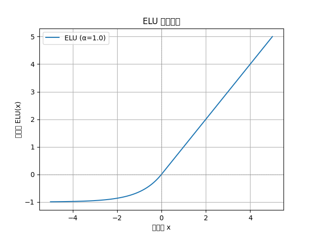
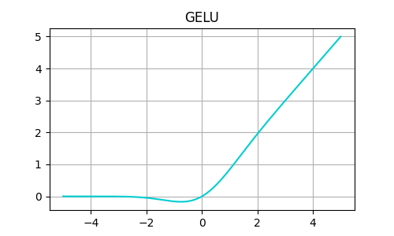
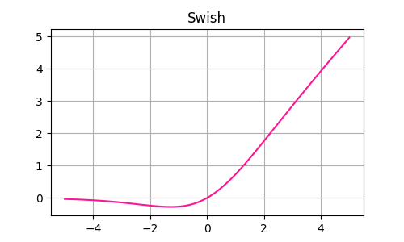
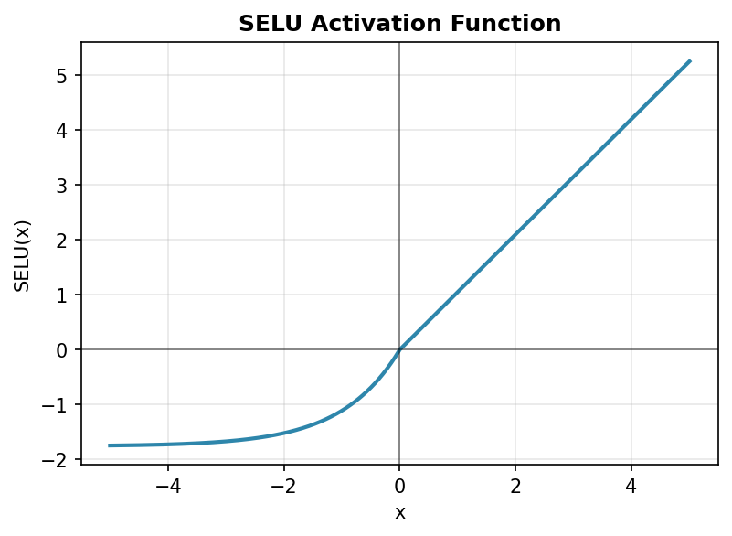
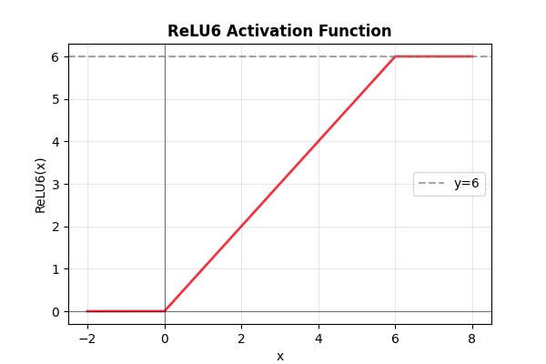

# 开题报告
## 深度学习核心原理预研与优化实践

随着人工智能技术的快速发展，深度学习已成为解决复杂问题的核心工具，尤其在计算机视觉、自然语言处理等领域展现出强大的能力。本课题聚焦于深度学习核心原理的预研与优化实践，旨在通过系统梳理神经网络的基础架构、激活函数、优化算法等关键技术，结合团队分工与实验设计，探索高效训练策略，为后续模型优化与应用落地提供理论支撑与实践经验。

本报告将从以下三个维度展开：

1. **核心原理预研**
2. **技术现状：激活函数与优化器总结**
3. **团队分工与实验规划**

详细阐述技术路线与实施计划。
# 一、核心原理预研
## 1. 神经网络基本概念
- **输入层、隐藏层、输出层**：神经网络由多层神经元组成，输入层接收特征，隐藏层自动学习高层特征，输出层给出预测。
- **端到端学习**：只需提供输入 \(x\) 与标签 \(y\)，网络自动学习中间特征，无需人工设计。
- **黑盒特性**：隐藏层学到的特征可能难以解释，但通常对预测非常有用。
---

## 2. 神经元与激活函数

l → 层编号，用于区分不同网络层的权重、偏置和激活。
单个神经元公式：
\[
z^{[l]} = W^{[l]} a^{[l-1]} + b^{[l]}, \quad a^{[l]} = g(z^{[l]})
\]

- **W^{[l]}**: 权重矩阵 \(n^{[l]} \times n^{[l-1]}\)  
- **b^{[l]}**: 偏置向量 \(n^{[l]} \times 1\)  
- **g(z)**: 非线性激活函数  
  - **Sigmoid**: \(g(z) = 1/(1+e^{-z})\)  
  - **ReLU**: \(g(z) = \max(0,z)\)  
  - **tanh**: \(g(z) = \tanh(z)\)  

**作用**：激活函数引入非线性，使网络能够拟合复杂函数。  
**重要性**：没有非线性激活，多层网络退化为线性模型，失去表达能力。

---

## 3. 前向传播（Forward Propagation）
矩阵化实现：
\[
Z^{[1]} = W^{[1]} X + b^{[1]}, \quad A^{[1]} = g(Z^{[1]})
\]
\[
Z^{[2]} = W^{[2]} A^{[1]} + b^{[2]}, \quad A^{[2]} = g(Z^{[2]})
\]

- **X**: 输入矩阵 \(n_x \times m\)（m为样本数）  
- 每层激活 \(A^{[l]} \in \mathbb{R}^{n^{[l]} \times m}\)  

**作用**：将输入数据经过权重和激活函数计算，生成网络预测输出。  
**重要性**：矩阵化实现提高计算效率，尤其在 NumPy 中对大规模数据集训练至关重要。

---

## 4. 损失函数（Loss Function）
- 二分类交叉熵：
 i → 样本序号，用于批量计算或循环求和。
\[
L(\hat{Y}, Y) = - \frac{1}{m} \sum_{i=1}^{m} \left[ y^{(i)} \log \hat{y}^{(i)} + (1-y^{(i)}) \log (1-\hat{y}^{(i)}) \right]
\]

**作用**：量化预测与真实值的差距，用于梯度计算。  
**重要性**：损失函数定义直接影响梯度方向和训练效果。

---

## 5. 反向传播（Backpropagation）与链式法则
### 5.1 链式法则公式
\[
\frac{\partial L}{\partial W^{[l]}} = \frac{\partial L}{\partial a^{[L]}} \cdot \frac{\partial a^{[L]}}{\partial z^{[L]}} \cdots \frac{\partial z^{[l]}}{\partial W^{[l]}}
\]

**作用**：通过链式法则逐层计算梯度。  
**重要性**：保证多层网络参数正确更新，核心是“逐层传播误差”。

### 5.2 单隐藏层示例
- 输出层梯度：
\[
dZ^{[2]} = A^{[2]} - Y \quad (1 \times m)
\]
\[
dW^{[2]} = \frac{1}{m} dZ^{[2]} (A^{[1]})^T \quad (n_y \times n^{[1]})
\]
\[
db^{[2]} = \frac{1}{m} \sum_{i=1}^{m} dZ^{[2]} \quad (n_y \times 1)
\]

- 隐藏层梯度：
\[
dZ^{[1]} = (W^{[2]})^T dZ^{[2]} \circ g'(Z^{[1]}) \quad (n^{[1]} \times m)
\]
\[
dW^{[1]} = \frac{1}{m} dZ^{[1]} X^T \quad (n^{[1]} \times n_x)
\]
\[
db^{[1]} = \frac{1}{m} \sum_{i=1}^{m} dZ^{[1]} \quad (n^{[1]} \times 1)
\]

**作用**：计算每层参数对损失的敏感度，用于梯度下降更新。  
**重要性**：清楚矩阵维度有助于手动实现 NumPy 反向传播，避免维度错误。

---

## 6. 参数更新与优化器
- **梯度下降**：
\[
W^{[l]} := W^{[l]} - \alpha dW^{[l]}, \quad b^{[l]} := b^{[l]} - \alpha db^{[l]}
\]

- **Mini-batch**：每次更新使用 B 个样本，提高效率  
- **Momentum**：
\[
v_{dW^{[l]}} = \beta v_{dW^{[l]}} + (1-\beta) dW^{[l]}, \quad
W^{[l]} := W^{[l]} - \alpha v_{dW^{[l]}}
\]

**作用**：根据梯度调整权重，实现网络训练。  
**重要性**：优化算法直接影响收敛速度和稳定性。

---

## 7. 参数初始化
- 避免对称性问题：随机小值初始化 \(N(0,0.1)\)  
- **Xavier/He 初始化**：
\[
W^{[l]} \sim N\Big(0, \frac{2}{n^{[l]} + n^{[l-1]}}\Big)
\]

**作用**：保证每层激活方差合理，缓解梯度消失/爆炸。  
**重要性**：合理初始化是训练深层网络的基础。

---

## 8. 正则化
- **L2正则化**：
\[
J_{L2} = J + \frac{\lambda}{2} \sum_l \| W^{[l]} \|^2
\]
- 更新公式：
\[
W^{[l]} := (1-\alpha \lambda) W^{[l]} - \alpha dW^{[l]}
\]

**作用**：限制权重过大，防止过拟合。  
**重要性**：提升模型泛化能力，特别是在小数据集上。

---
在完成神经网络基础架构的预研后，我们进一步聚焦 **激活函数** 这一关键组件。激活函数通过引入非线性能力，使网络能够拟合复杂数据分布，其选择直接影响模型的收敛速度与最终性能。

以下是对当下主流激活函数的分类总结与选择方法：
# 二、常见激活函数总结

### 激活函数作用

激活函数（Activation Function）用于为神经网络引入非线性能力。若没有激活函数，无论网络多深，本质仍是线性变换：

$$
f(x)=Wx+b
$$

无法拟合复杂非线性数据。

---

# 1. ReLU（当前最经典）

| 项目 | 内容 |
|---|---|
| 数学公式 | \(f(x)=max(0,x)\) |
| 函数图像 |  |
| 输出范围 | $[0, \infty)$
| 优点 | 计算快；缓解梯度消失；收敛速度快；CNN最主流 |
| 缺点 | 神经元死亡；非零均值；输出无界 |
| 常见用途 | CNN、MLP隐藏层 |

---

# 2. Sigmoid

| 项目 | 内容 |
|---|---|
| 数学公式 | \(f(x)=\frac{1}{1+e^{-x}}\) |
| 函数图像 |  |
| 输出范围 | （\(0,1\)）|
| 优点 | 输出可表示概率；平滑连续 |
| 缺点 | 梯度消失严重；非零均值；计算慢 |
| 常见用途 | 二分类输出层 |

---

# 3. Tanh

| 项目 | 内容 |
|---|---|
| 数学公式 | \(f(x)=\frac{e^x-e^{-x}}{e^x+e^{-x}}\) |
| 函数图像 |  |
| 输出范围 | （\(-1,1\)） |
| 优点 | 零均值；收敛快于Sigmoid |
| 缺点 | 仍存在梯度消失 |
| 常见用途 | 传统RNN/LSTM |

---

# 4. ELU

| 项目 | 内容 |
|---|---|
| 数学公式 | \(f(x)=\begin{cases}x,&x>0\\ \alpha(e^x-1),&x\le0\end{cases}\) |
| 函数图像 |  |
| 优点 | 更接近零均值；梯度平滑；训练稳定 |
| 缺点 | 包含指数运算；速度慢于ReLU |
| 常见用途 | 深层CNN |

---

# 5. Leaky ReLU

| 项目 | 内容 |
|---|---|
| 数学公式 | \(f(x)=\begin{cases}x,&x>0\\ \alpha x,&x\le0\end{cases}\) |
| 函数图像 |  |
| 优点 | 解决ReLU死亡问题；负区间保留梯度 |
| 缺点 | \(\alpha\)需手动设置 |
| 常见用途 | GAN、深层CNN |

---

# 6. GELU（Transformer主流）

| 项目 | 内容 |
|---|---|
| 数学公式 | \(GELU(x)=x\Phi(x)\) |
| 函数图像 |  |
| 优点 | 梯度平滑；适合大模型；Transformer默认激活 |
| 缺点 | 计算复杂度略高 |
| 常见用途 | GPT、BERT、Transformer |

---

# 7. Swish

| 项目 | 内容 |
|---|---|
| 数学公式 | \(f(x)=x\cdot\sigma(\beta x)\) |
| 函数图像 |  |
| 优点 | 平滑非单调；深层网络性能优秀 |
| 缺点 | 推理慢于ReLU |
| 常见用途 | EfficientNet |

---

# 8. Softmax

| 项目 | 内容 |
|---|---|
| 数学公式 | \(Softmax(x_i)=\frac{e^{x_i}}{\sum_j e^{x_j}}\) |
| 输出特点 | \(\sum_i p_i=1\) |
| 优点 | 适合多分类；概率可解释 |
| 缺点 | 类别多时计算量大 |
| 常见用途 | 多分类输出层 |

---

# 9. PReLU

| 项目 | 内容 |
|---|---|
| 数学公式 | \(f(x)=\begin{cases}x,&x>0\\ ax,&x\le0\end{cases}\) |
| 优点 | 自动学习负半轴斜率；更灵活 |
| 缺点 | 增加参数量；小数据集易过拟合 |
| 常见用途 | 部分CNN |

---

# 10. SELU

| 项目 | 内容 |
|---|---|
| 数学公式 | \(SELU(x)=\lambda\begin{cases}x,&x>0\\ \alpha(e^x-1),&x\le0\end{cases}\) |
| 函数图像 |  |
| 优点 | 自归一化；减少BatchNorm依赖 |
| 缺点 | 对初始化要求严格 |
| 常见用途 | 特殊深层网络 |

---

# 11. ReLU6

| 项目 | 内容 |
|---|---|
| 数学公式 | \(f(x)=min(max(0,x),6)\) |
| 函数图像 |  |
| 输出范围 | \([0,6]\) |
| 优点 | 适合移动端量化 |
| 缺点 | 通用性能提升有限 |
| 常见用途 | MobileNet |

---

# 激活函数使用趋势

| 排名 | 激活函数 | 当前使用情况 |
|---|---|---|
| 1 | ReLU | CNN最主流 |
| 2 | Sigmoid | 二分类输出 |
| 3 | Tanh | 传统RNN |
| 4 | ELU | 深层CNN |
| 5 | Leaky ReLU | GAN常用 |
| 6 | GELU | Transformer主流 |
| 7 | Swish | EfficientNet |
| 8 | Softmax | 多分类输出 |
| 9 | PReLU | 部分CNN |
| 10 | SELU | 特殊网络 |
| 11 | ReLU6 | 轻量化模型 |

---
激活函数的设计解决了网络非线性表达的问题，而优化器的选择则决定了参数更新的效率与稳定性。不同的优化策略适用于不同规模的模型与数据场景，合理选择优化器可显著加速训练过程并提升模型精度。以下是对深度学习优化器的系统梳理与选择原则。
# 三、深度学习常用优化器整理

优化器（Optimizer）是深度学习中用于更新模型参数、最小化损失函数的核心算法。不同优化器的参数更新方式不同，因此在收敛速度、训练稳定性、泛化能力和适用场景上存在明显差异。

---

## 主流优化器分类介绍与优劣

### 1. 基础梯度下降类

#### 基础思想

这类优化器的核心区别在于：**每次计算梯度时所使用的样本数量不同**。

---

| 优化器 | 原理 | 优点 | 缺点 | 现状 / 场景 |
|---|---|---|---|---|
| Batch Gradient Descent（BGD） | 每次使用全部训练数据计算梯度 | 梯度估计准确；收敛稳定；凸问题可收敛到全局最优 | 内存消耗极大；训练速度慢；无法处理超大数据集 | 仅用于小规模凸优化 |
| Stochastic Gradient Descent（SGD） | 每次仅使用1个样本更新参数 | 更新速度快；支持在线学习；梯度噪声有助于跳出局部最优 | 梯度波动大；训练不稳定；容易震荡 | 在线学习、小规模任务 |
| Mini-batch SGD（MB-SGD） | 每次使用一个小批量（Batch）计算梯度 | 兼顾稳定性和训练效率；适配GPU并行；现代深度学习基础框架 | 需手动调学习率；收敛速度相对较慢；不适合稀疏特征 | 当前深度学习默认训练方式 |

---

### 2、带动量的梯度下降类

#### 核心思想

为了解决SGD震荡严重、收敛缓慢的问题，引入“动量（Momentum）”机制，使参数更新具有惯性。

---

| 优化器 | 原理 | 优点 | 缺点 | 适用场景 |
|---|---|---|---|---|
| SGD with Momentum（SGD-M） | 累积历史梯度方向，引入动量项 | 大幅减少震荡；加快收敛；更容易跳出鞍点 | 仍需手动调学习率和Momentum参数；不适配稀疏特征 | CNN、CV任务 |
| Nesterov Accelerated Gradient（NAG） | 先按历史动量更新，再计算修正梯度 | 收敛更快；精度更高；震荡更小 | 超参数仍需调节；无法自适应学习率 | 中小规模CV任务 |

---

### 3、自适应学习率优化器

#### 核心思想

不同参数自动分配不同学习率，减少人工调参成本。

---

| 优化器 | 原理 | 优点 | 缺点 | 适用场景 |
|---|---|---|---|---|
| AdaGrad | 根据历史梯度累积自适应调整学习率 | 适合稀疏特征；减少学习率调参 | 学习率会持续衰减到极小值；后期训练停止 | NLP早期任务 |
| RMSprop | 使用EMA统计梯度平方，缓解AdaGrad衰减问题 | 收敛稳定；适合非凸优化 | 对超参数敏感；未结合动量 | RNN、时序模型 |
| AdaDelta | 使用更新量替代全局学习率 | 不需要设置初始学习率；训练稳定 | 大规模任务效果不如Adam系列 | 中小规模任务 |

---

### 4、Adam系列优化器

#### 核心思想

结合“动量优化”和“自适应学习率”的优势。

---

| 优化器 | 原理 | 优点 | 缺点 | 当前地位 / 场景 |
|---|---|---|---|---|
| Adam（Adaptive Moment Estimation） | Momentum + RMSprop；同时维护一阶矩和二阶矩 | 收敛快；调参简单；适配绝大多数任务 | 泛化能力有时不如SGD；权重衰减处理不正确 | 快速原型验证 |
| AdamW | 解耦权重衰减与梯度更新 | 泛化性能更强；训练稳定；当前最主流 | 计算量略高于Adam | Transformer、大模型默认优化器 |
| Nadam | Adam + Nesterov Momentum | 收敛更快；学习率鲁棒性更好 | 不如AdamW稳定；未解决原始Adam权重衰减问题 | 深层网络、高精度任务 |

---

### 5、大模型优化器

| 优化器 | 原理 | 优点 | 缺点 | 适用场景 |
|---|---|---|---|---|
| LAMB（Layer-wise Adaptive Moments optimizer for Batch training） | 按层自适应调整学习率，支持超大Batch训练 | 支持数千到数万Batch；大幅缩短大模型训练时间；泛化下降较小 | 小模型收益不明显；计算复杂度较高 | 超大规模大模型预训练 |

---

### 6、优化器核心特性对比表

| 优化器 | 自适应学习率 | 动量支持 | 权重衰减修正 | 核心优势 | 核心缺点 | 适用场景 |
|---|---|---|---|---|---|---|
| Mini-batch SGD | × | 可选 | × | 实现简单；泛化能力强 | 收敛慢；需手动调参 | 小数据集、传统CV |
| SGD-M | × | √ | × | 收敛更快；泛化性能好 | 仍需调参；不适应稀疏特征 | CNN、CV任务 |
| NAG | × | √（改进） | × | 收敛更快；震荡更小 | 需手动调参 | 中小规模CV |
| AdaGrad | √ | × | × | 稀疏特征友好 | 学习率衰减过快 | NLP早期任务 |
| RMSprop | √ | 可选 | × | 解决AdaGrad衰减问题 | 超参数敏感 | RNN、时序模型 |
| Adam | √ | √ | × | 调参简单；收敛快 | 泛化较弱；权重衰减问题 | 快速实验 |
| AdamW | √ | √ | √ | 泛化强；稳定；当前主流 | 计算量略高 | Transformer、大模型 |
| LAMB | √ | √ | √ | 支持超大Batch训练 | 小模型优势不明显 | 大模型预训练 |

---

### 7、优化器选择方法指南

| 场景 | 推荐优化器 | 原因 |
|---|---|---|
| 通用默认任务 | AdamW | 调参简单；泛化稳定；适配绝大多数任务 |
| Transformer / 大模型 | AdamW | 当前工业界默认方案 |
| 超大Batch训练 | LAMB | 支持超大规模并行训练 |
| 图像分类 / 目标检测（CV） | SGD-M | 泛化性能通常优于自适应优化器 |
| RNN / LSTM | RMSprop | 时序任务训练稳定 |
| 小项目快速实验 | Adam | 收敛快；调参少 |
| 稀疏特征任务（NLP/推荐） | AdamW | 自适应学习率适合稀疏更新 |

---

### 8、总结

| 优化器 | 核心特点 |
|---|---|
| SGD | 泛化强但收敛慢 |
| SGD-M | SGD加入动量机制 |
| NAG | 提前预测梯度方向 |
| AdaGrad | 稀疏特征友好 |
| RMSprop | 改进AdaGrad学习率衰减 |
| Adam | 最经典通用优化器 |
| AdamW | 当前工业界默认方案 |
| Nadam | Adam + Nesterov |
| LAMB | 超大模型训练优化器 |

---

技术选型与理论分析为实验奠定了基础，而明确的团队分工与进度管理是项目落地的关键。为确保各模块高效协同，我们根据成员技术栈与任务优先级制定了分工方案与时间规划。
# 四、 团队分工细节

| 成员 |已完成/正在进行的工作 | 
| --- | --- | 
| w | 完成最初项目结构搭建；完成 `nn/` 核心模块开发及相关测试；完成不同隐藏层结构和optimizer的实验对比；完成后续加分项内容开发| 
| L | 负责 MNIST 数据读取、预处理、训练/验证/测试集划分、mini-batch DataLoader；后续承担 Fashion-MNIST 扩展实验的数据接入；配合完成不同 batch size 的实验对比。|
| X| 完成不同learning-rate的实验对比；承担文档整理工作，撰写开题报告，补充公式推导，整理训练曲线、PPT 和演示材料。|

### 协作方式

本项目使用 **Git + GitHub** 进行代码管理和小组协作。

团队分工明确了责任边界，而任务进度表则通过阶段化目标将研究计划转化为可执行的行动。以下为五周实验周期的详细安排，涵盖环境搭建、模型训练到最终交付的全流程。
# 五、 任务进度表

本项目计划按 5 周推进，覆盖“基础 MLP 准确率达标”和两个加分项。

| 周次 | 阶段目标 | 主要任务 | 负责人 | 阶段交付物 |
| --- | --- | --- | --- | --- |
| 第 1 周 | 环境准备与核心原理验证 | 完成项目目录设计；明确 row-major 数据格式约定；实现并测试 `Linear`、`ReLU`、`SoftmaxCrossEntropyLoss`、`SGD`、`Sequential`；使用随机假数据跑通 `forward -> loss -> backward -> update`。 | 同学 A 主责；同学 B/C 学习接口和基础原理 | 项目骨架；`nn/` 核心模块；单元测试；随机数据前后向传播验证结果。 |
| 第 2 周 | 数据模块与基础训练跑通 | 完成 MNIST 数据读取、展平、归一化和 train/validation/test 划分；实现 DataLoader 的 shuffle 和 mini-batch；编写 `train.py` 和 `evaluate.py` 的基础流程；使用小模型 `784 -> 128 -> 10` 验证 loss 能下降、accuracy 能上升。 | 同学 B 主责数据；同学 A 主责训练联调；同学 C 记录过程 | `data/` 模块；基础训练脚本；验证集 accuracy 记录；数据预处理说明。 |
| 第 3 周 | 准确率达标与超参数实验 | 使用主模型 `784 -> 256 -> 128 -> 10` 训练 MNIST；调试学习率、batch size、初始化方法和训练轮数；绘制 Loss 与 Accuracy 曲线；力争测试集 accuracy 达到 95% 以上。 | 同学 A 主责调参；同学 B 负责 batch size 实验；同学 C 整理曲线和表格 | 达标模型；训练曲线；学习率、batch size、网络深度对比实验；阶段性实验分析。 |
| 第 4 周 | 加分项一：BatchNorm | 在 NumPy 框架中实现 BatchNorm 层，完成 forward/backward；加入 `Linear -> BatchNorm -> ReLU` 的网络结构；比较有无 BatchNorm 时的收敛速度、验证集准确率和训练稳定性。 | 同学 A 主责实现；同学 B 协助测试；同学 C 整理对比结果 | `BatchNorm` 层；相关测试；有/无 BatchNorm 的实验曲线和分析。 |
| 第 5 周 | 加分项二与结项交付 | 接入 Fashion-MNIST 数据集，复用自研 MLP 框架完成训练；比较 MNIST 与 Fashion-MNIST 的准确率差异和原因；完善实验报告、演示视频和答辩 PPT；整理最终代码和压缩包。 | 同学 B 主责数据接入；同学 A 主责模型适配与结果检查；同学 C 主责报告和 PPT | Fashion-MNIST 实验结果；最终实验报告；演示视频素材；答辩 PPT；最终提交压缩包。 |

本开题报告从理论预研到工程实践，系统规划了深度学习模型优化的技术路径与实施步骤。通过核心原理梳理、组件对比分析、分工协作与进度控制，团队将逐步验证技术可行性，并探索模型性能的进一步提升空间。